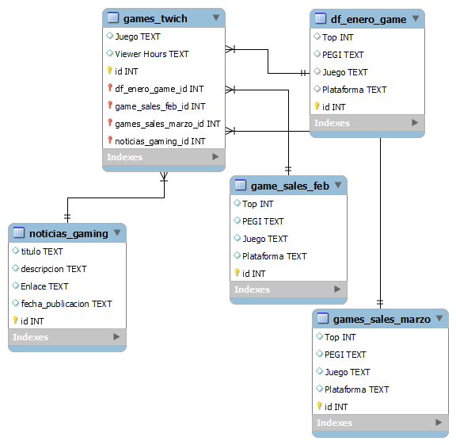

## Proyecto de Gamers

Este proyecto tiene como objetivo recolectar datos relacionados con la industria de los videojuegos, específicamente en plataformas como YouTube y Twitch, así como obtener información sobre los juegos más vendidos y noticias relevantes de última hora. Para lograr esto, se utilizaron técnicas de web scraping, intentos de llamadas a la API y descarga de documentos.

## Fuentes de datos utilizadas

Se recolectaron datos de las siguientes fuentes:

- [SocialBlade - Top Games YouTube](https://socialblade.com/youtube/top/category/games)
- [SocialBlade - Top Games YouTube en España](https://socialblade.com/youtube/top/country/es)
- [SocialBlade - Top Twitch Channels](https://socialblade.com/twitch/top/50)
- [TwitchMetrics - Twitch Games Viewership](https://www.twitchmetrics.net/games/viewership)
- [TwitchTracker - Top Games on Twitch](https://twitchtracker.com/games)
- [TwitchTracker - Game Statistics](https://twitchtracker.com/statistics/games)
- [AEVI - Los videojuegos más vendidos](http://www.aevi.org.es/la-industria-del-videojuego/los-videojuegos-mas-vendidos/2023/3/)

## Base de datos

Se creó una base de datos para almacenar los datos recolectados y establecer relaciones entre los juegos más vistos en Twitch, los juegos más vendidos y las noticias más relevantes. Se utilizaron diferentes métodos para extraer y transformar los datos, como web scraping, procesamiento de archivos descargados y llamadas a la API.

## Estructura del proyecto

El proyecto se divide en las siguientes secciones:

- **Web Scraping**: Se utilizaron técnicas de web scraping para obtener datos de las fuentes mencionadas anteriormente. Esto implicó analizar la estructura de las páginas web, extraer la información relevante y guardarla en formatos adecuados para su posterior procesamiento.

- **API**: Se intentó realizar llamadas a la API de algunas plataformas, como Twitch, para obtener información adicional sobre los juegos y canales. Se exploraron diferentes endpoints y se extrajeron los datos necesarios para enriquecer la base de datos.

- **Procesamiento de datos**: Los datos recolectados fueron limpiados, transformados y almacenados en la base de datos. Se establecieron relaciones entre las tablas para facilitar consultas y análisis posteriores.

- **Análisis y visualización**: Se realizaron consultas a la base de datos para obtener información relevante y se generaron visualizaciones para representar los datos de manera comprensible.

## Requisitos del proyecto

Para ejecutar este proyecto, se requiere tener instalado el entorno de desarrollo adecuado, así como las bibliotecas y dependencias necesarias. Se recomienda revisar el archivo `requirements.txt` para obtener una lista completa de los paquetes requeridos.

## Contribución

Se aceptan contribuciones para mejorar este proyecto. Si deseas colaborar, por favor envía tus propuestas y mejoras mediante pull requests.

